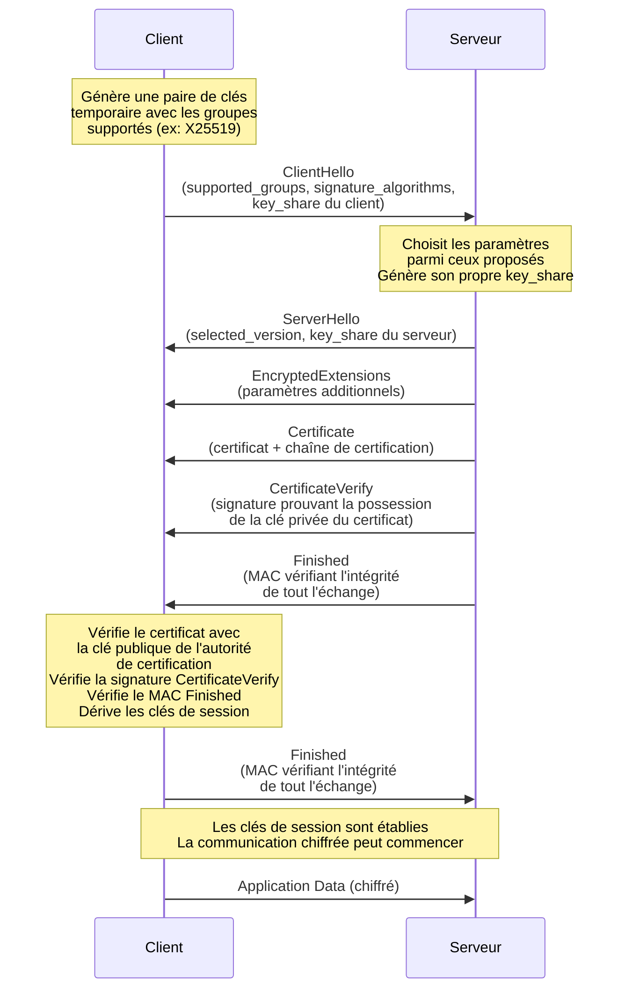

## Les bases de la cryptographie

### Algorithmes asymétriques

Les algorithmes asymétriques se découpent en deux éléments distincts ; une clé publique et une clé privée.

Ces algorithmes possèdent différentes propriétés :

- La clé publique permet de chiffrer la donnée tandis que la clé privée permet de la déchiffrer.
- À partir de la clé privée on peut retrouver la clé publique.
- On peut signer une donnée à partir de la clé privée et vérifier l'authenticité de la signature grâce à la clé publique.

Il existe plusieurs algorithmes qui permettent d'implémenter cette mécanique :

- RSA : Basé sur un problème de factorisation de nombres premiers.
- DSA : Basé sur un problème de logarithme discret.
- Les courbes elliptiques : Basé sur un problème de logarithme discret sur des courbes elliptiques.

### Algorithmes symétriques

Les algorithmes symétriques permettent de chiffrer une donnée avec le même secret que celui qui va permettre de le déchiffrer. Ainsi lors d'un échange de donnée chiffrée, les deux interlocuteurs doivent convenir à l'avance du secret à utiliser.

Il existe plusieurs algorithmes qui permettent d'implémenter cette mécanique :

- AES : Algorithmes permettant d'associer différentes méthodes pour chiffrer des données à partir d'un secret.
- chacha : Un autre algorithme de chiffrement.

### Algorithme de hashage

Il s'agit d'une famille d'algorithmes qui permet de transformer une entité numérique (une chaîne de caractères, ou un chiffre) en une courte chaîne de caractères. En théorie, il n'est pas possible de retrouver l'élément d'origine à partir d'un hash, cependant, si la même entité est hashée sur deux ordinateurs différents avec le même algorithme, alors on devrait retrouver le même hash dans les deux cas.

Là aussi il existe de nombreux algorithmes qui permettent de hasher des éléments :

- MD5
- sha

### Explication d'un échange de clés de base

Le but d'un échange de clés est de créer un canal de communication sécurisé entre deux interlocuteurs. Ici Alice et Bob.

Cette méthode peut être appliquée quel que soit le support, mais elle est à la base de toutes les communications chiffrées sur internet.

Voici le déroulé d'un échange de clés :
- Au préalable Alice et Bob disposent tous deux d'une paire de clés générée dans un algorithme asymétrique de leur choix : clé privée / clé publique.
- Ils vont échanger leur clé publique.
- Chacun de son côté va générer un secret qui va correspondre à un nombre ou une chaîne aléatoire.
- Ils vont échanger leur secret, donc Bob va envoyer la chaîne qu'il a générée à Alice en la chiffrant avec la clé publique de cette dernière et Alice va faire la même chose avec la chaîne qu'elle a générée et la clé publique de Bob.
- Les deux interlocuteurs vont alors pouvoir déchiffrer le message qui leur a été envoyé grâce à leurs clés privées respectives.
- Ils sont donc à ce stade tous les deux en possession du secret de l'autre et de leur propre secret.
- Ils n'ont donc plus qu'à additionner leur propre secret avec celui de leur correspondant·e pour obtenir un nouveau secret.
- Leurs futurs échanges pourront donc être réalisés en utilisant un algorithme symétrique dont la clé de chiffrement sera le secret obtenu à l'étape précédente. 

Cette méthode est extrêmement fiable, mais elle a un défaut, si Alice et Bob essaient de communiquer à travers un canal non fiable, un attaquant qui arriverait à intercepter tous leurs messages depuis le début et disposant lui-même d'une paire de clés privée / clé publique pourrait lui-même se faire passer pour Alice auprès de Bob et de Bob auprès d'Alice. C'est une attaque de l'homme du milieu active ([MITM](https://fr.wikipedia.org/wiki/Attaque_de_l%27homme_du_milieu)).

Pour se prémunir de cela il existe deux solutions :
- Avoir une mécanique permettant à l'un des deux interlocuteurs de certifier que la clé publique qu'il a reçue de la part de l'autre interlocuteur est bien à celui qu'elle prétend être et pas à un tiers. C'est la mécanique standard sur le protocole https et cette mécanique est une autorité de certification.
- Avoir une clé publique qui a déjà été échangée au préalable par un moyen fiable afin que lors du début d'un échange l'un des deux interlocuteurs ait déjà la clé publique de l'autre. C'est ce que fait SSH par exemple quand on s'authentifie par clé.

### Rôle des autorités de certification

Les autorités de certification ou certificate authority (CA) sont des organisations qui ont pour rôle de signer les certificats d'autres organisations (leurs clients).

Ainsi, si je souhaite créer un site web et l'exposer en https, je vais devoir respecter plusieurs étapes :
- Déclarer mon nom de domaine auprès d'un registrar (comme l'[Afnic](https://www.afnic.fr/) pour un site en .fr). Heureusement cette étape fastidieuse peut être simplifiée en passant par des intermédiaires comme [Gandi](https://www.gandi.net/) ou [OVH](https://www.ovhcloud.com/fr/domains/).
- Générer une paire de clés dans l'algorithme asymétrique de son choix (RSA, DSA, ECC...). La clé privée doit impérativement être conservée dans un lieu sécurisé.
- Contacter une autorité de certification qui va contrôler d'une façon ou d'une autre que vous êtes bien le possesseur du nom de domaine que vous souhaitez faire passer en https. Vous allez envoyer votre clé publique et ils vont vous renvoyer un certificat, qui contient votre clé publique, des métadonnées comme le nom de domaine auquel elle est rattachée, la date de début et de fin de validité du certificat... et une signature cryptographique qui pourra être vérifiée par n'importe quel ordinateur connecté à internet qui prouve que ni la clé publique ni ses métadonnées ont été altérées. C'est ce certificat qui va être envoyé aux utilisateurs de votre site et c'est grâce à lui que les navigateurs vont considérer que le site est sécurisé.

L'autorité de certification la plus utilisée pour de petits sites est [Let's Encrypt](https://letsencrypt.org/) car elle permet de délivrer des certificats gratuits et fournit un outil, le [certbot](https://certbot.eff.org/) qui permet de signer automatiquement ses certificats.

Pour fournir des certificats à ses clients, l'autorité de certification a elle-même besoin d'une paire de clés. La clé publique de n'importe quelle autorité de certification publique est présente d'office sur tous les ordinateurs ayant un système d'exploitation à jour. Les navigateurs et autres services connectés à internet utilisent cette clé publique pour vérifier que les certificats des sites sur lesquels on va sont bien valides.

Quant aux clés privées de ces autorités de certification (ou clés primaires) elles sont gardées très précieusement dans des infrastructures hautement sécurisées (incluant notamment des [HSM](https://fr.wikipedia.org/wiki/Hardware_Security_Module)). En cas de compromission de la clé privée d'une certificate authority, c'est toute l'infrastructure du web moderne qui est compromise. Si un état ou une organisation venait à utiliser la clé privée d'une autorité de certification de manière abusive, il pourrait très facilement déployer des attaques de l'homme du milieu et espionner des communications a priori chiffrées.

### Rôle du cipher

Dans un échange TLS, le cipher permet de définir quels sont les algorithmes qui vont être utilisés. Sur toutes les versions de SSL/TLS, il permet de définir l'algorithme symétrique et la fonction de hashage. Mais depuis TLS 1.2 il laisse aussi la possibilité de sélectionner un algorithme asymétrique. En effet TLS 1.2 laisse la possibilité de créer une paire de clés temporaire. Ainsi la paire de clés de base du serveur (celle signée par l'autorité de certification) ne sert plus qu'à faire des opérations de signature et la paire de clés temporaire ne sert quant à elle plus qu'à faire des opérations de chiffrement. Cette mécanique n'apparaît plus dans TLS 1.3 (2018), car il s'agit aujourd'hui du mode par défaut. La clé de chiffrement est maintenant toujours différente de la clé de signature.

Voici quelques exemples de cipher TLS 1.2 avec et sans clé temporaire :
- `TLS_ECDHE_RSA_WITH_AES_128_GCM_SHA256`: Clé elliptique temporaire + authentification RSA + chiffrement symétrique en AES-128-GCM + fonction de hashage SHA-256
- `TLS_ECDHE_ECDSA_WITH_AES_128_GCM_SHA256`: Clé elliptique temporaire + authentification ECDSA + chiffrement symétrique en AES-128-GCM + fonction de hashage SHA-256
- `TLS_RSA_WITH_AES_128_GCM_SHA256`: Pas de clé temporaire + authentification RSA + chiffrement symétrique en AES-128-GCM + fonction de hashage SHA-256

Voici quelques exemples de cipher TLS 1.3 :
- `TLS_AES_256_GCM_SHA384`: Chiffrement symétrique en AES-256-GCM + fonction de hashage SHA-384
- `TLS_CHACHA20_POLY1305_SHA256`: Chiffrement symétrique en CHACHA20 + fonction de hashage en SHA-256

En TLS 1.3, le cipher ne contient plus quel algorithme asymétrique on veut utiliser pour l'authentification, ni l'information que la clé est temporaire. En effet on a maintenant les informations `signature_algorithms` et `supported_groups` qui nous permettent de préciser quel sont les algorithmes de chiffrement asymétrique qu'on autorise.

### Explication du protocole TLS 1.3

Le déroulé d'un handshake TLS 1.3 se fait comme suit :

1. Le client commence par générer une paire de clés temporaire en utilisant l'un des groupes supportés. Il envoie ensuite un `ClientHello` contenant les `supported_groups` (les algorithmes d'échange de clés qu'il supporte), les `signature_algorithms` (les algorithmes de signature qu'il accepte pour l'authentification du serveur) et son `key_share` (sa partie publique de la clé temporaire).

2. Le serveur reçoit le `ClientHello`, sélectionne les paramètres qu'il souhaite utiliser parmi ceux proposés, génère à son tour un `key_share` et répond avec un `ServerHello` contenant la version retenue et son propre `key_share`.

3. Juste après le `ServerHello`, le serveur envoie les `EncryptedExtensions` contenant des paramètres additionnels comme les protocoles ALPN ou les extensions spécifiques. Tous les messages suivants sont maintenant chiffrés avec une clé dérivée du `key_share` du client et du serveur.

4. Le serveur envoie ensuite son `Certificate` qui contient son certificat ainsi que toute la chaîne de certification jusqu'à l'autorité racine. Cela permet au client de vérifier l'authenticité du serveur.

5. Le serveur envoie un `CertificateVerify` qui est une signature cryptographique générée avec la clé privée associée au certificat. Ce message prouve que le serveur possède bien la clé privée correspondant au certificat envoyé.

6. Le serveur termine sa partie du handshake en envoyant un `Finished` contenant un MAC qui vérifie l'intégrité de tous les messages échangés jusqu'ici. Ce message permet de s'assurer que l'échange n'a pas été altéré par un tiers.

7. Le client vérifie la validité du certificat grâce à la clé publique de l'autorité de certification qu'il possède dans son magasin de certificats, vérifie la signature du `CertificateVerify`, puis vérifie le MAC du `Finished`. Il dérive ensuite les clés de session à partir des deux `key_share`.

8. Le client envoie à son tour un message `Finished` pour confirmer au serveur que l'échange est intègre. À partir de ce moment, les deux interlocuteurs disposent des mêmes clés de session et peuvent commencer à échanger des données applicatives chiffrées.

L'avantage de TLS 1.3 par rapport à son prédécesseur est que l'échange nécessite un seul round-trip (1-RTT) après le `ClientHello`, contre deux pour TLS 1.2. De plus, contrairement à TLS 1.2 où le cipher précisait l'algorithme asymétrique, TLS 1.3 utilise les champs `supported_groups` pour l'échange de clés et `signature_algorithms` pour l'authentification, ce qui permet une bien plus grande flexibilité.

## Impact des ordinateurs quantiques sur les algorithmes actuels

Toutes les familles de clés asymétriques sont hypothétiquement cassables dans le cas où un ordinateur quantique serait déployé. L'algorithme qui permet de briser ces clés est l'[algorithme de Shor](https://fr.wikipedia.org/wiki/Algorithme_de_Shor). Cet algorithme permet de ramener la complexité de la décomposition d'un nombre en facteurs premiers (problème sous-jacent de RSA) ou la résolution d'un logarithme discret (problématique derrière DSA ou ECC) en un temps polynomial, c'est-à-dire en un temps techniquement accessible avec un ordinateur quantique.

Dans le cas des algorithmes symétriques, leur complexité est réduite à leur racine carrée. Par exemple une clé AES256 a une complexité équivalente à une clé AES128 pour un ordinateur quantique. L'algorithme qui permet de réduire cette complexité est l'[algorithme de Grover](https://fr.wikipedia.org/wiki/Algorithme_de_Grover).

L'algorithme de Grover impacte aussi les fonctions de hashage. Par exemple un hash en SHA-512 a une complexité équivalente à un SHA-256 pour un ordinateur quantique.

## Quels sont les risques que cela présente

Le jour où une entreprise ou un gouvernement disposera d'un ordinateur quantique suffisamment puissant pour appliquer les algorithmes de Shor et de Grover à nos méthodes de chiffrement actuelles est noté le [Q-day](https://fr.wikipedia.org/wiki/Menace_quantique). C'est le moment où nous ne pourrons plus faire confiance dans des algorithmes comme RSA.

- [Harvest now, decrypt later](https://fr.wikipedia.org/wiki/R%C3%A9colter_maintenant,_d%C3%A9chiffrer_plus_tard) : C'est une technique employée massivement par les services de renseignements. Il y a des types de canaux qui, même s'ils sont chiffrés aujourd'hui, peuvent avoir de la valeur dans le futur. Il peut donc être intéressant pour un attaquant de stocker de la donnée chiffrée dans l'espoir d'être en mesure de la décrypter plus tard. On peut prendre comme exemple l'[ambassade des États-Unis à Paris](https://fr.wikipedia.org/wiki/Ambassade_des_%C3%89tats-Unis_en_France) qui dispose d'une station d'écoute sur son toit pour, entre autres, espionner les communications entre l'Élysée et Matignon. La France ne réagit pas car les communications sont chiffrées et les États-Unis font le pari qu'ils seront capables de décrypter ces données plus tard quand ils auront atteint la suprématie quantique. Il s'agit donc d'un risque à prendre en compte dès aujourd'hui.
  - Un risque qui en découle pour les utilisateurs d'internet. Étant donné qu'on ne peut pas dire si notre navigation sur internet est enregistrée ou non à un instant t, cela signifie qu'on peut partir du principe qu'elle l'est au moins à certains moments. Quand on s'authentifie à un site web, le mot de passe transite en clair dans le tunnel TLS avant d'être hashé côté serveur pour le stockage. Le hashage côté serveur limite l'impact de l'algorithme de Grover, mais un attaquant qui a sauvegardé l'intégralité de l'échange TLS peut le décrypter avec un ordinateur quantique et retrouver le mot de passe en clair tel qu'il a été envoyé. Si un jour nous passons le Q-day, il serait bon de changer, par précaution; tous ses mots de passe.
- Briser une autorité de certification : Avec un ordinateur quantique, il serait possible de retrouver la clé privée d'une autorité de certification à partir de sa clé publique. Une fois cette clé retrouvée l'attaquant pourrait facilement mettre en place des attaques de l'homme du milieu sans pouvoir être détecté. Il s'agit d'un risque qui n'a pas forcément besoin d'être anticipé. Il supprime juste la confiance qu'on peut avoir dans les certificats traditionnels à partir du moment où le Q-day est passé. Mais cela n'a aucun impact sur les données déjà chiffrées.

## Quels algorithmes en remplacement

En 2016, l'organisme de normalisation américain [NIST](https://www.nist.gov/) a lancé un grand concours dans lequel des mathématiciens, cryptographes ou laboratoires de recherche pouvaient proposer des algorithmes qui auraient pour but de remplacer les algorithmes de chiffrement asymétrique actuels. Ils ont reçu 82 soumissions et en 2024 ils ont normalisé les 3 plus adaptés. Les autres algorithmes ayant été éliminé soit car brisé mathématiquement, soit car trop compliqué à mettre en place ou demandant trop de puissance de calcul.

Les 3 algorithmes restant sont donc :

- [FIPS203](https://csrc.nist.gov/pubs/fips/203/final) ou ML-KEM anciennement appelé CRYSTALS-Kyber : Pour la partie chiffrement.
- [FIPS204](https://csrc.nist.gov/pubs/fips/204/final) ou ML-DSA anciennement appelé CRYSTALS-Dilithium : Pour la partie signature.
- [FIPS205](https://csrc.nist.gov/pubs/fips/205/final) ou SLH-DSA anciennement appelé SPHINCS+ : Un autre algorithme de signature.

Il faut cependant garder une certaine méfiance envers ces algorithmes. Non pas qu'ils ne soient pas fiables (il y a de grande chance qu'ils le soient), mais que comme dit précédemment, sur 82 algorithmes initialement présentés de nombreux ont été mathématiquement brisés. On a actuellement moins de recul sur ces algorithmes post-quantique que sur les algorithmes de chiffrement asymétrique plus traditionnel.

Pour les algorithmes symétriques, on peut continuer d'utiliser les algorithmes connus, il faut "simplement" augmenter leur complexité afin que même divisée par deux par un ordinateur quantique, la sécurité des secrets chiffrés ne soit pas mise à mal.

## Contre-mesure applicable aujourd'hui

Dans TLS 1.3 nous l'avons vu précédemment, le cipher ne précise plus l'algorithme asymétrique qui va être utilisé pour l'échange de clé. C'est maintenant les champs `signature_algorithms` et `supported_groups` qui contiennent l'information.

Aujourd'hui le plus adapté est d'utiliser une mécanique hybride en utilisant à la fois une clé elliptique et à la fois ml-kem. Il est également possible d'utiliser ml-dsa pour la partie signature.

Voici un exemple de configuration valable :

- `signature_algorithms`: `mldsa44`
- `supported_groups`: `SecP256r1MLKEM768`

Petite note, il existe plusieurs variantes de ML-KEM et ML-DSA :

| Catégorie NIST | ML-KEM | ML-DSA |
|----------------|--------|--------|
| 1 | `ML-KEM-512` | `ML-DSA-44` |
| 3 | `ML-KEM-768` | `ML-DSA-65` |
| 5 | `ML-KEM-1024` | `ML-DSA-87` |

Ce qui signifie que dans l'exemple précédent l'algorithme de signature utilisé est de catégorie 1 et l'algorithme de chiffrement est de catégorie 3.

## Évolutions à venir dans nos infrastructures

Comme vu précédemment, grâce aux évolutions récentes des protocoles que nous utilisons, l'informatique grand public commence à être prêt pour pouvoir survivre au Q-day, mais il y a encore beaucoup d'étapes pour que tout soit prêt. Par exemple :

- SSH ne supporte actuellement pas les identity files avec des algorithmes post-quantiques... Quand ce sera disponible il faudra commencer à migrer ses clés d'authentification.
- Les autorités de certifications n'utilisent pas encore d'algorithme post-quantique pour signer nos certificats... Et nos certificats ne peuvent pas être post-quantiques non plus.
- Sur [ProtonMail](https://mail.proton.me/), il n'est pas encore possible de sécuriser son compte avec du chiffrement post-quantique. Il faut rester alerte et faire la transition quand cela devient possible. Le provider de mail [TutaNota](https://tuta.com/) est quant à lui bien compatible.
- Les clés [YubiKey](https://www.yubico.com/get-yubikey/) ne supportent actuellement pas le chiffrement post-quantique. Étant donné qu'elles ne peuvent pas être mises à jour, au moment du Q-day elles devront être toutes détruites. Cependant en France on a [Thales qui fait des supports FIDO2](https://cpl.thalesgroup.com/fr/access-management/authenticators/fido-devices) qui sont compatibles.

## Le Q-day c'est pour quand ???

En février 2025 Microsoft a sorti un processeur [Majorana 1](https://news.microsoft.com/source/emea/2025/02/microsoft-devoile-majorana-1-le-premier-processeur-quantique-au-monde-alimente-par-des-qubits-topologiques/?lang=fr) censé être une révolution qui permettrait de mettre plusieurs millions de qubits sur une seule puce (et donc de passer le Q-day). Plus d'un an et demi après on a toujours pas de papier de recherche associé et la communauté scientifique ne s'accorde toujours pas sur le fait que cette puce a une chance ou non de fonctionner...

Quand on observe un ordinateur quantique, il y a deux paramètres à observer, le nombre de qubits et le nombre de qubits stables. En effet contrairement à un ordinateur traditionnel, une même opération peut donner des résultats différents entre ses exécutions sur un ordinateur quantique... On a aujourd'hui des ordinateurs qui dépassent le millier de qubits, mais le nombre de qubits stables ne dépasse pas aujourd'hui les 60. Et ce depuis en réalité plusieurs années. Si bien que certains chercheurs sont en train de se demander s'il n'y a pas une limite physique empêchant la construction d'un ordinateur quantique opérationnel.

De plus avec l'émergence de l'intelligence artificielle, il y a potentiellement certains usages que l'on voulait déléguer à des ordinateurs quantiques qui peuvent être réalisés, certes de manière moins efficace, mais néanmoins de manière assez satisfaisante par des IAs. On peut citer deux axes de recherches où l'IA a des résultats satisfaisants et où on misait beaucoup sur l'informatique quantique :

- La recherche en matériaux : De manière traditionnelle, il est assez difficile de rechercher de nouveaux matériaux sans tester de les faire en laboratoire et tester leurs propriétés. Avec un ordinateur quantique, il serait potentiellement possible de simuler les propriétés de matériaux à partir de leur structure atomique. Mais certains projets d'intelligence artificielle comme [Google GNoME](https://deepmind.google/blog/millions-of-new-materials-discovered-with-deep-learning/) semblent montrer des résultats spectaculaires grâce à une structure de réseaux de neurones bien pensée. Est-ce qu'un ordinateur quantique ferait mieux ? Peut-être, mais aujourd'hui on a déjà ça et ça a le mérite de déjà fonctionner contrairement à l'ordinateur quantique qui devient de plus en plus hypothétique au fur et à mesure que les années passent.
- Le parcours de graphes : Il existe de nombreuses problématiques impliquant des parcours de graphes qui sont aujourd'hui sous-optimaux. On peut prendre pour exemple le [problème du voyageur de commerce](https://fr.wikipedia.org/wiki/Probl%C3%A8me_du_voyageur_de_commerce), ou plus simplement la façon dont Amazon range ses entrepôts. Une optimisation algorithmique de ces façons de parcourir un graphe se traduit pour le secteur de la logistique par des économies à tous les étages. Là encore, de nombreux algorithmes d'intelligence artificielle permettent de s'approcher de l'optimum. Même si contrairement à un ordinateur quantique ils s'approchent de l'optimum, ils ne le trouvent pas. Reste qu'il s'agit d'une avancée majeure et que contrairement à l'informatique quantique elle est déjà là.

## Conclusion

Le risque qu'on passe le Q-day est réel, il faut donc anticiper ce risque. Il est néanmoins assez peu probable qu'un ordinateur quantique capable de briser nos méthodes de chiffrement actuelles apparaisse du jour au lendemain.

Mais au-delà de la question de l'apparition d'un ordinateur quantique, un papier récent nommé "[Forging 1024-bit RSA signatures in nearly SNFS time](https://eprint.iacr.org/2026/2131)" montre qu'ils arrivent à falsifier dans certains cas assez spécifiques et avec un peu de temps une clé RSA1024, et mettent en évidence qu'il faut "commencer à abandonner RSA pendant la transition vers le post-quantique". Pour aller plus loin avec les résultats de tels papiers, il faudrait commencer à systématiquement utiliser des combinaisons d'algorithmes : un algorithme "traditionnel" et un algorithme post-quantique.

Une mise à jour de ce document sera nécessaire quand les autorités de certifications vont commencer à passer sur des algorithmes de signature post-quantique.

En attendant pour les administrateurs système et les développeurs il est nécessaire de se mettre en veille peut-être que le Q-day n'arrivera jamais... Mais s'il arrive, on doit tous être préparés pour ne pas risquer l'intégrité des infrastructures qu'on est censé protéger et d'exposer les données de nos utilisateurs.

## Sources

- [Barbhack : Crypto post-quantique : intérêt, enjeux, et perspectives](https://www.barbhack.fr/2023/assets/slides/barbhack23_public_deneuville.pdf)
- [USI event : La lévitation quantique: Julien Bobroff](https://www.youtube.com/watch?v=6kg2yV_3B1Q&list=PL_wN0FeVwhX5VSlQBioX21WNgRUoTTS5F)
- [RFC 9846 : TLS 1.3](https://www.rfc-editor.org/info/rfc9846/) 
- [Wikipedia : cryptographie post-quantique](https://fr.wikipedia.org/wiki/Cryptographie_post-quantique)

